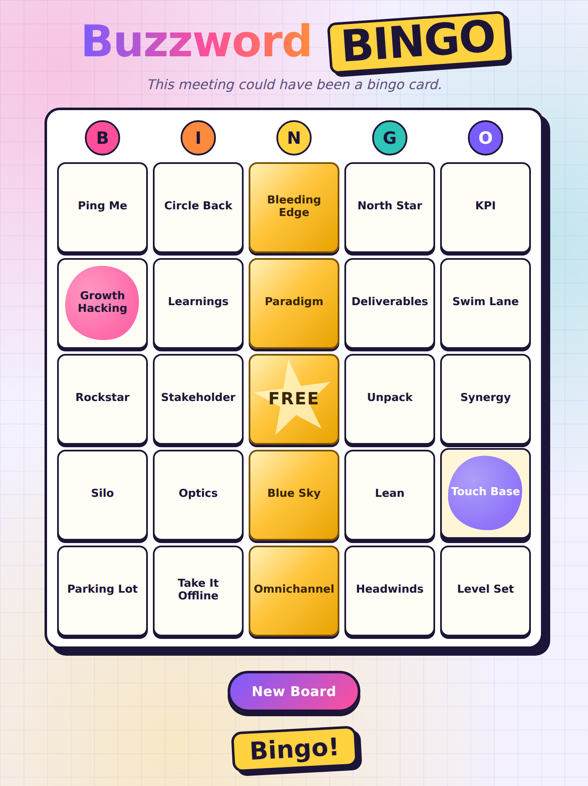

# Buzzword Bingo

Mark off corporate buzzwords as you hear them in meetings. Complete a row, column, or diagonal to win.

<p align="center"></p>

- Works fully offline. No accounts, ads, analytics or tracking ([privacy policy](PRIVACY.md)).
- Runs on the web, Windows, macOS, Linux, Android and iOS from one small codebase.
- Adapts to phone screens and supports dark mode.

## How it's built

The game is a static React 18 app with no bundler and no network access at runtime. The same build ships in four forms:

| Target | Tooling | Output |
| --- | --- | --- |
| Web / PWA | Express (local) or GitHub Pages | `dist/` |
| Windows (Microsoft Store), macOS, Linux | [Tauri](https://tauri.app), plus [tauri-windows-bundle](https://github.com/Choochmeque/tauri-windows-bundle) for MSIX | `.msixbundle`, `.exe`, `.dmg`, `.AppImage`, `.deb` |
| Android (Google Play) | [Capacitor](https://capacitorjs.com) | `android/` project, open in Android Studio |
| iOS (App Store) | Capacitor | `ios/` project, open in Xcode |

Every packaged app bundles all of its files, so it works offline from the first launch.

## Development

```sh
npm install
npm start            # builds dist/ and serves it on http://localhost:3000
npm run desktop      # runs the desktop app (needs Rust; see below)
npm test             # unit tests for the game logic
npm run lint         # ESLint
```

The source lives in `public/`: the game rules are in `game.js` and the React UI is in `app.js`. `npm run build` copies it, together with React, into a self-contained `dist/`. The project uses Node 24 (see `.nvmrc`); Node 22.13 or later also works.

The **CI** workflow runs lint, tests and a build on every pull request and every push to `main`.

## Packaging

| Command | What it does |
| --- | --- |
| `npm run dist:store` | Microsoft Store `.msixbundle` for x64 and arm64, Windows 11 only (run on Windows) |
| `npm run dist:desktop` | Installers for the current OS: `.exe` on Windows, `.dmg` on macOS, `.AppImage`/`.deb` on Linux |
| `npm run store:identity` | Writes your Partner Center identity into the MSIX config (see the publishing guide) |
| `npm run cap:android` | Syncs the web build into `android/` and opens Android Studio |
| `npm run cap:ios` | Syncs the web build into `ios/` and opens Xcode (Mac only) |
| `npm run icons` | Regenerates all icons and store tiles from `public/icons/icon.svg` |

Desktop builds need the [Rust toolchain](https://rustup.rs) and the [Tauri prerequisites](https://v2.tauri.app/start/prerequisites/) for your OS. The desktop app is about 3–10 MB, because it uses the operating system's built-in web view instead of bundling a browser.

The **Package apps** GitHub Actions workflow builds the Microsoft Store, macOS, Linux, and Android test packages in the cloud, so you don't need Rust, Windows, or a Mac locally for desktop builds. Run it from the Actions tab, or push a `v*` tag.

For store submission, step by step, see [docs/PUBLISHING.md](docs/PUBLISHING.md).

## Feedback

Found a bug or have an idea? [Open an issue](https://github.com/pag3/buzzword-bingo/issues).

## License

[MIT](LICENSE) © Paul A. Gusmorino 3rd
